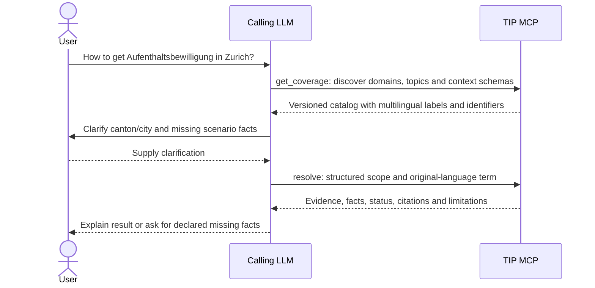
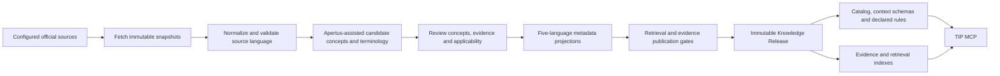
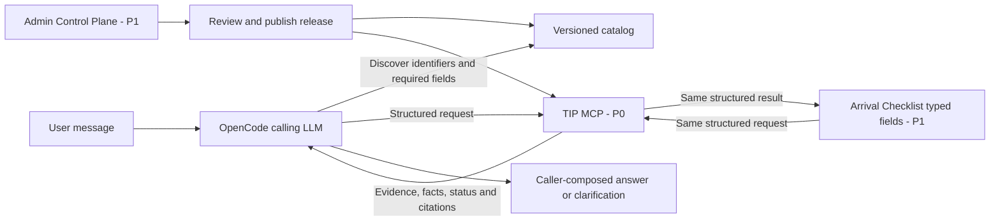
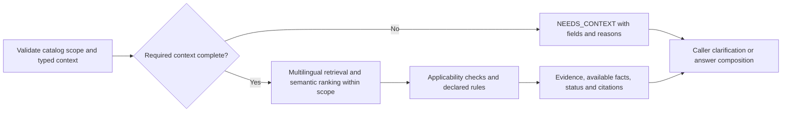
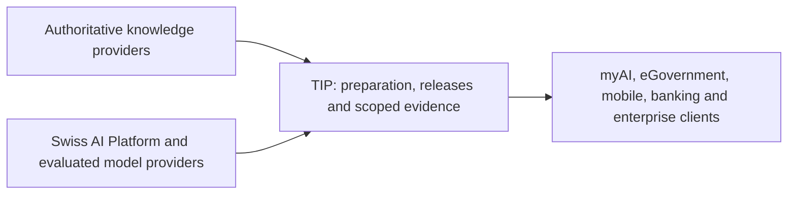
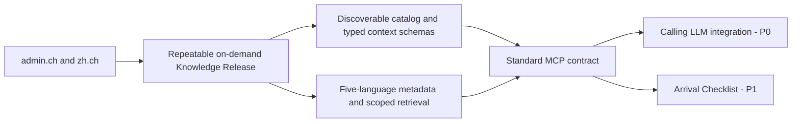

# Swisscom Trusted Information Platform

**Last update:** 17 September 2026

## First-Round Pitch Deck - Maximum 10 Minutes

**Format:** 7 slides, ~8:45 presentation + buffer.<br>
**Goal:** present a testable hackathon vertical slice and the target product it informs. This deck describes intended behavior, not implementation validation. The implemented contract is narrower and is specified in [docs/architecture/tool-contracts.md](https://github.com/swisstip/swiss-tip/blob/main/docs/architecture/tool-contracts.md): four tools, four statuses (`SUPPORTED`, `NEEDS_CONTEXT`, `OUT_OF_COVERAGE`, `STALE`), no five-language projections, and German and English search terms.

---

# Slide 1 - The Idea
## Beyond search and retrieval: governed knowledge for AI

**Swisscom Trusted Information Platform** publishes versioned, authoritative knowledge for AI clients and applications. Its MCP accepts an explicit knowledge scope and returns evidence, available verified facts, citations, freshness and limitations.

**The product is a governed knowledge service:** a discoverable catalog and structured evidence contract with versions, applicability and coverage limits. Search and vector retrieval power that service; RAG applications can consume it.

> **Your assistant understands the question. TIP supplies the authoritative evidence for the scope it requests.**

The calling LLM interprets the user message, chooses published identifiers, obtains missing facts and composes the answer. A form or workflow can construct the same request directly.

**Speaker note (~60s):** Web search helps discover sources. Vector retrieval finds relevant content, and RAG supplies context to answer generation. TIP packages authoritative knowledge as a reusable, governed service: what is covered, which version applies, and what evidence supports the requested scope. The assistant owns the conversation and answer; TIP owns the published knowledge and evidence contract. The hackathon tests this in one focused Swiss domain.

---

# Slide 2 - Hackathon Proof: admin.ch + zh.ch

Start with official federal and Canton Zurich sources: **admin.ch / SEM** and **zh.ch**.

The user asks their assistant:

> **How to get Aufenthaltsbewilligung in Zurich?**



Illustrative selected scope: `swiss-public / immigration / residence / residence-permit`, `intent=requirements`, `jurisdiction=CH-ZH`. The caller obtains these identifiers from discovery and establishes Canton Zurich as the intended scope; the sentence alone supplies no nationality, purpose or duration.

**Speaker note (~60s):** Make the boundary visible in the demo: first the caller selects catalog identifiers and clarifies facts; then show its structured MCP call. It preserves `Aufenthaltsbewilligung` as a `de` retrieval term. TIP does not require the caller to translate it into English or a source language. The identifiers here illustrate the planned contract and do not assert published coverage or legal requirements.

---

# Slide 3 - Hackathon Vertical Slice: Build, Then Serve



**P0 includes** compact metadata projections in `en`, `de`, `fr`, `it` and `rm`, multilingual lexical/concept/vector retrieval and semantic ranking. A release declares only the term/projection/source combinations that pass evaluation.

Broad topics organize discovery; independently supported concepts carry evidence and declare supported operations. Model proposals require review and publication gates before callers can use them.

The gates check claim scope, conditions, alternatives and procedure branches, and verify each proposed example question against its citations. Build reports distinguish excluded content, rejected proposals and missing or partial concepts.

**The gate is visible to the caller, not only to us.** Review is not a build-time detail the caller has to take on trust: every fact `resolve` returns names its own `review_status`, and carries `reviewed_on` and `reviewed_by` once a person has confirmed it against its cited excerpt. So the assistant can distinguish a human-confirmed statement from an assistant-authored one and say so to the user. When a question is critical enough that an unreviewed statement will not do, the caller sets `reviewed_only` and unconfirmed concepts come back as `OUT_OF_COVERAGE` with a `review_status_not_met` gap instead of a statement. In the committed KB1 release all 290 facts, across residence permits (including the EU free movement agreement), social insurance, tax at source, the driving licence, health insurance and naturalisation, are `human-reviewed` by a named reviewer against their cited excerpts (not a legal review; 249 of them in bulk groups), so the filter serves every fact today; a fact added later stays withheld from such a caller until someone confirms it in the review queue.

**Speaker note (~75s):** Builds are on demand. Normal requests use a published release and do not scrape government websites. Apertus is a candidate for knowledge preparation: concepts, classifications, terminology and compact metadata. Original source text remains authoritative. Scheduled and incremental Knowledge CI/CD is future work.

---

# Slide 4 - One Contract, Different Clients



- **OpenCode:** a standards-compatible example client; show `get_coverage`, `resolve` and, when needed, `get_evidence`.
- **Arrival Checklist (P1):** supplies typed fields directly; renders available requirements and unresolved conditions.
- **Admin Control Plane (P1):** exposes sources, catalog identifiers, context schemas, evidence, builds, evaluation and releases.

**Speaker note (~75s):** An LLM is one possible caller, not a server prerequisite. A warm client with a cached release catalog can normally resolve a complete request in one call. Catalog discovery, clarification and evidence inspection are separate interactions and count toward total tool use. Optional REST must preserve the same request and result semantics.

---

# Slide 5 - Runtime: Explicit Scope, Multilingual Evidence

Illustrative request after confirming Canton Zurich. Any required personal facts remain absent until supplied:

```json
{
  "schema_version": "structured-grounding/v1",
  "release_id": "example-release-001",
  "knowledge_space_id": "swiss-public",
  "domain_id": "immigration",
  "topic_id": "residence",
  "concept_ids": ["residence-permit"],
  "intent": "requirements",
  "jurisdiction": {"country_code": "CH", "canton_code": "CH-ZH"},
  "context": {},
  "as_of": "2026-09-06",
  "scope_mode": "exact",
  "retrieval_terms": [{"text": "Aufenthaltsbewilligung", "language": "de"}],
  "max_evidence": 5
}
```



If the discovered schema requires them, return `NEEDS_CONTEXT` for `context.nationality_group` and `context.purpose`, with allowed values and reasons. This illustrates contract behavior, not Zurich legal requirements.

**Speaker note (~90s):** Five-language metadata and reviewed terminology connect supported original-language terms to eligible original sources. A term's language never restricts source language implicitly. Semantic scores rank within explicit scope; they cannot invent facts, change jurisdiction or broaden an exact request. Only explicit, bounded `descendants` traversal can expand concept scope. TIP returns structured evidence; the caller writes the answer. Runtime semantic models may embed or rank evidence, while a separately evaluated embedding provider supports vector retrieval.

---

# Slide 6 - Why Swisscom?

**Team product and business hypothesis:** reusable governed knowledge can serve several applications through the same contract.



Potential value: managed knowledge, hosting, enterprise integration and API/MCP consumption. Swisscom's infrastructure and distribution could support this layer; the hackathon does not establish commercial demand or production readiness.

**Future opportunity:** trusted publishers could distribute licensed Data Products through TIP. Marketplace mechanics, metering and settlement remain outside this MVP.

**Speaker note (~90s):** The immediate proof is reusable evidence: multiple callers use one governed release and receive inspectable scope, provenance and limitations. Apertus remains a candidate provider for Swiss multilingual knowledge preparation, and the platform stays provider-independent. Commercial mechanisms belong to a later product decision. Keep detailed marketplace economics and Swiss Hike for Q&A or the future-product appendix.

---

# Slide 7 - Deliverable and Proof



Acceptance evidence must show:

- Discovery supplies enough identifiers and required fields to construct a valid request.
- Valid requests within covered scope, with adequate context and sufficient verified support, return compact evidence, supported facts and exact citations. Missing conditional facts return declared fields; complete context can still leave an evidence limitation.
- Scope, release, date and source-language constraints remain enforced, including on failures and retries.
- Evaluated multilingual term/projection/source combinations retrieve relevant evidence without client translation into a common language.
- Missing coverage, insufficient evidence, partial support, conflicts and stale evidence remain explicit.

**Product value:** a reusable, governed knowledge contract that stays consistent across callers and retrieval technologies.

> **Your assistant understands the question. TIP supplies the authoritative evidence for the scope it requests.**

**Speaker note (~75s):** Assess the server on structured requests and retrieval quality. Assess caller question interpretation, catalog selection, clarification and answer fidelity separately. The planned output is a focused, testable MCP and reproducible release process. Future domains, live capabilities, private overlays and publisher products can build on that contract without adding obligations to this hackathon.

---

# Timing

| Slide | Target |
|---|---:|
| 1 | 1:00 |
| 2 | 1:00 |
| 3 | 1:15 |
| 4 | 1:15 |
| 5 | 1:30 |
| 6 | 1:30 |
| 7 | 1:15 |
| **Total** | **8:45** |

Keep detailed crawler design, database schemas, Swiss Hike, autonomous refresh and marketplace workflows for later rounds or Q&A. Live demonstrations must label **caller interpretation/clarification**, **structured MCP request**, **TIP evidence result** and **caller answer**.

## Additional info for Q&A - Corpus preparation

The nationwide corpus, fetched and extracted on 10 and 11 September 2026, holds **12,117 official pages** of 12,461 download targets from a catalogue of **59 federal and cantonal sources covering all 26 cantons**, including Fedlex, with a text dataset of 12,117 records. Its text records stay outside Git; its 304 concept candidates passed automated review only, and no release is built from it.

Use the [corpus statistics appendix](full-presentation.md#slide-26---additional-info-nationwide-residence-permit-corpus) as backup outside the timed seven-slide presentation. It records acquisition and extraction results alongside failed downloads and unfinished review, language and OCR work. These counts do not establish exhaustive coverage or end-to-end retrieval quality.
