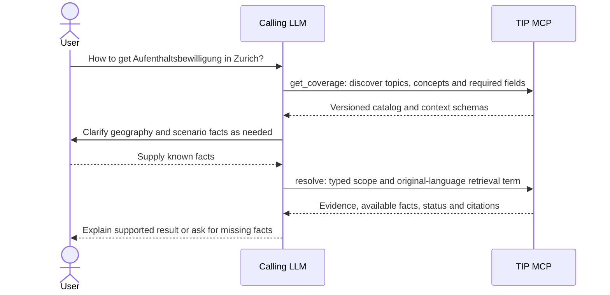
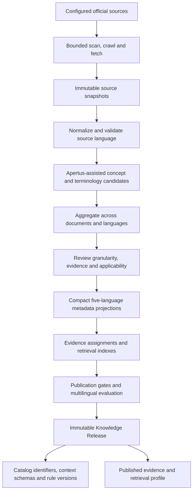
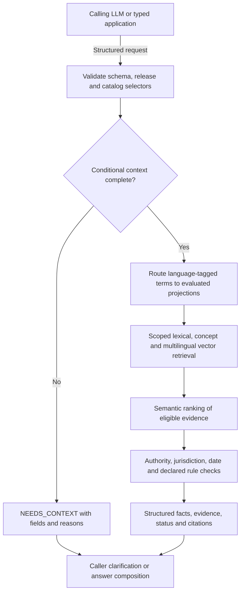
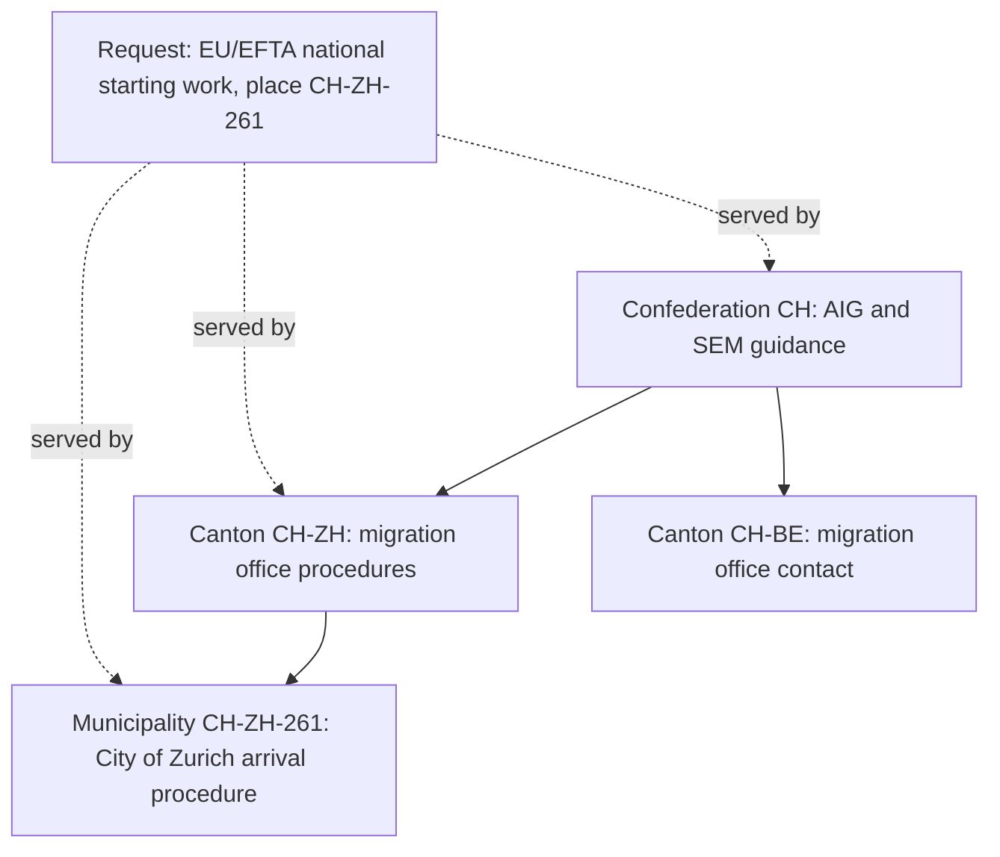
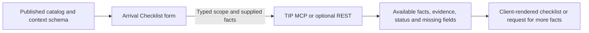
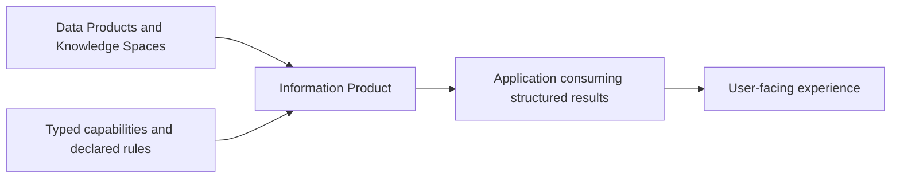
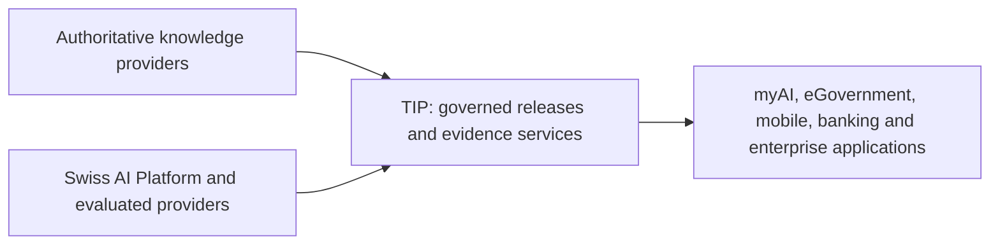
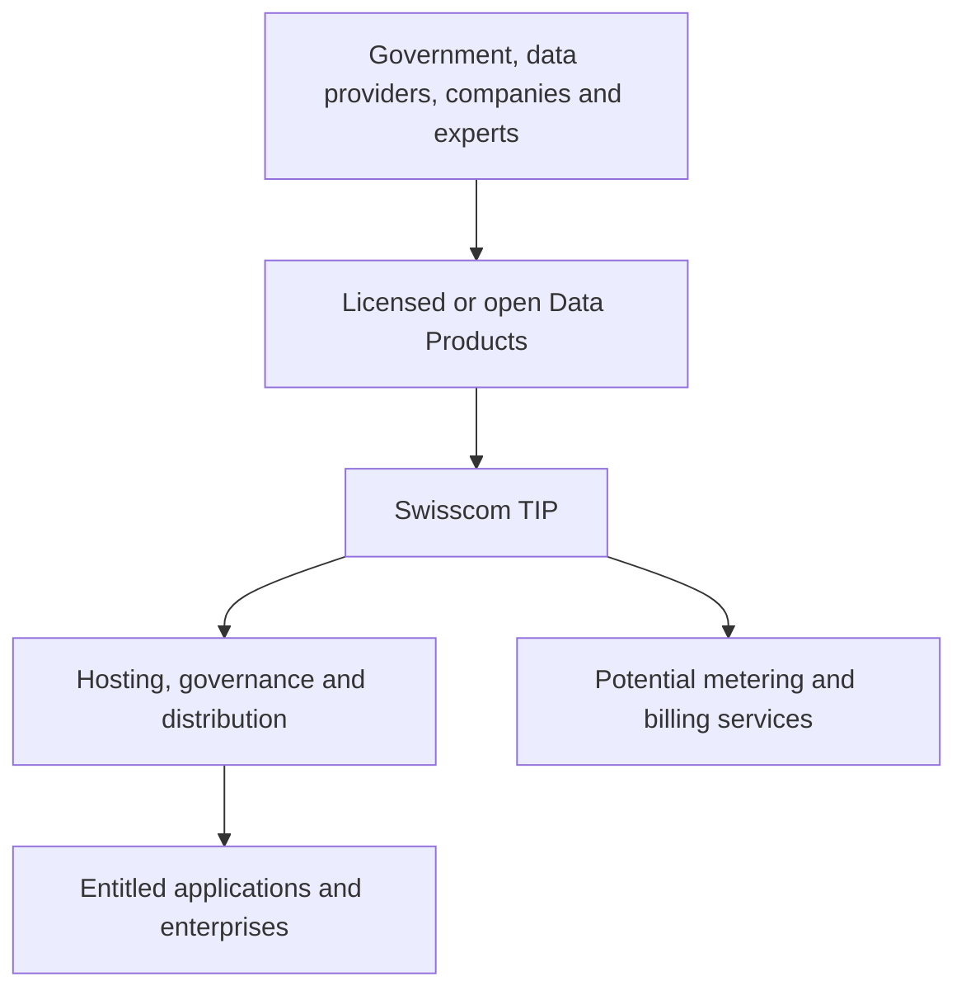
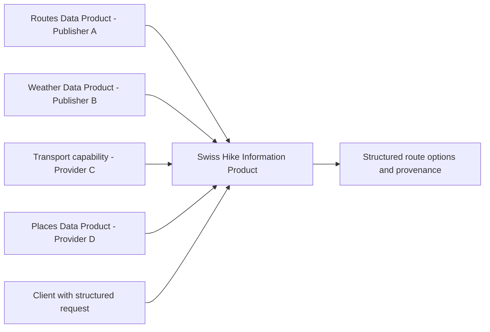
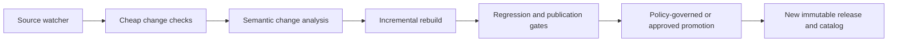

# Full Pitch Presentation - Swisscom Trusted Information Platform

**Last update:** 17 September 2026

This deck describes the proposed product and acceptance evidence. It does not establish implementation validation, except where a slide says so: slide 9 shows the implemented review status of each fact, and slide 10 reports the implemented and tested jurisdiction hierarchy. The implemented contract is narrower than the proposal and is specified in [docs/architecture/tool-contracts.md](https://github.com/swisstip/swiss-tip/blob/main/docs/architecture/tool-contracts.md): four tools, four statuses (`SUPPORTED`, `NEEDS_CONTEXT`, `OUT_OF_COVERAGE`, `STALE`), no five-language projections, and German and English search terms. Slide 13 is optional P2 stretch material; slides 14-23 cover the future product. These appendix topics are outside P0/P1 acceptance scope.

Slide 26 adds measured statistics of the nationwide corpus acquired for the next release, with remaining coverage and review gaps.

## Slide 1 - Trusted Information Infrastructure

# Swisscom Trusted Information Platform

**Beyond search and retrieval: governed knowledge for AI.**

TIP publishes versioned knowledge and accepts explicitly scoped requests. It returns compact evidence, available verified facts, citations, freshness and limitations.

**The product is a governed knowledge service:** a discoverable catalog and structured evidence contract with versions, applicability and coverage limits. Search and vector retrieval power that service; RAG applications can consume it.

> **Your assistant understands the question. TIP supplies the authoritative evidence for the scope it requests.**

Supported original-language retrieval terms use multilingual metadata and semantic retrieval without mandatory translation into a common language.

---

## Slide 2 - Published Challenge and Team Design

The documented challenge asks for an MCP server that makes authoritative public Swiss information accessible: grounded, cited, jurisdiction-aware, fresh, efficient, operable and easy to integrate.

**Our team design:** compile governed releases and publish a structured evidence contract. This boundary and its schema are team choices, not asserted challenge requirements.

| Calling LLM or application | TIP builder and MCP |
|---|---|
| Interprets user wording and intent | Publishes a versioned knowledge catalog |
| Selects published identifiers and clarifies geography | Validates identifiers, hierarchy and jurisdiction |
| Obtains scenario facts | Publishes typed context schemas and reports missing fields |
| Supplies original-language retrieval terms | Retrieves and ranks evidence within explicit scope |
| Composes the final answer | Returns supported facts, evidence, citations and limitations |

A form can construct the same request without an LLM. Compatibility with the challenge harness must be checked during implementation; any conversational harness adapter remains outside the MCP core.

---

## Slide 3 - Team MVP: A Focused Vertical Slice

Start with **admin.ch / SEM** and **Canton Zurich / zh.ch**. Coverage must be published and evaluated for the selected operations.

The user message is input to the caller:

> How to get Aufenthaltsbewilligung in Zurich?



The caller establishes whether Zurich means city or canton when that matters. It cannot infer nationality, purpose, permit category or intended duration from this sentence.

The multilingual proof tests supported language-tagged terms against eligible original sources. TIP retains five-language metadata projections and scoped semantic ranking; the caller owns mixed-language conversation and final response language.

**Speaker note:** Visibly label caller interpretation/clarification, structured MCP request, TIP evidence result and caller answer. Use the same sequence in the first-round demo. Client-language fixtures can exercise English, German and mixed-language wording; server fixtures begin with their resulting structured requests.

---

## Slide 4 - On-Demand Knowledge Build



The metadata projection languages are `en`, `de`, `fr`, `it` and `rm`, with a declared Romansh idiom profile. Labels, aliases and projections retain provenance.

An extracted candidate is a proposal. Exact source offsets alone do not prove that it captures every condition; evidence and semantic-completeness gates are required before publication.

Those gates assess claim support, scope, conditions, alternatives and procedure branches, plus each proposed example question against its citations. Build coverage distinguishes excluded content, missing concepts, rejected proposals and partial representations; a model's approval alone does not qualify a claim for publication.

No scheduler or incremental refresher is required in the MVP.

---

## Slide 5 - Stable Knowledge Is Compiled and Discoverable

Web search supports source discovery, vector storage supports similarity retrieval, and RAG connects retrieved context to generation. TIP's product is the governed knowledge release and the contract through which applications consume it. TIP makes knowledge preparation, publication and scope-aware evidence reusable across callers.

Normal MCP requests use a published release rather than scraping official websites. Immutable snapshots and releases support reproducibility, exact citations, predictable evaluation and source etiquette.

The original source remains authoritative. A release freezes:

- Knowledge Space, domain, topic and concept hierarchy with stable identifiers and reviewed multilingual labels.
- Supported information operations, canonical jurisdictions and valid scope combinations.
- Typed applicability schemas, conditional required fields, temporal coverage and declared rules.
- Evidence assignments, five-language metadata, language profiles and evaluated retrieval configurations.

`get_coverage` supports bounded discovery by Knowledge Space or parent identifier. A caller can navigate `Immigration -> Residence -> Residence permit`, inspect supported operations and cache the result by immutable release identity. These labels illustrate catalog structure rather than declaring published coverage.

A topic's existence does not imply coverage of every operation. The caller selects from finite published intents such as `requirements`; it does not invent identifiers or submit a sentence as an intent.

---

## Slide 6 - AI for Knowledge Preparation and Scoped Retrieval

Apertus is a candidate provider for build-time concept extraction, classification, terminology and compact metadata preparation. Model proposals enter the same review and publication process as other derived knowledge.

At runtime, semantic models may embed, score or rerank eligible evidence within supplied scope. Vector retrieval uses a separately evaluated multilingual embedding provider. Neither task authorizes interpreting the user question, inventing applicability facts or generating the final answer inside TIP.

**P0 includes** five-language metadata projections, reviewed terminology and multilingual lexical/concept/vector retrieval with semantic ranking. Each release enables only evaluated retrieval-term/projection/source combinations.

| Concern | Evaluation responsibility |
|---|---|
| Multilingual term recall and evidence relevance | TIP retrieval evaluation |
| Scope, date, context and rule compliance | TIP contract and applicability evaluation |
| Question interpretation and catalog selection | Caller integration evaluation |
| Clarification and final answer fidelity | Caller integration evaluation |

Reviewed German and Swiss German term profiles may route to `de` projections where evaluated. This creates no rule about the caller's answer language. Metadata translations do not replace original source text.

**Speaker note:** Keep provider choice separate from the product guarantee. Model language breadth does not prove retrieval coverage. Every advertised profile needs evidence of recall, precision, scope compliance and acceptable latency. TIP remains provider-independent.

---

## Slide 7 - Runtime: Explicit Scope, Multilingual Evidence



`exact` keeps the declared concept scope. Only explicitly requested `descendants` permits bounded traversal defined by the catalog; it does not relax jurisdiction, date or source-language constraints.

Terms guide retrieval within scope. They cannot establish or overwrite domain, topic, intent, jurisdiction or context. An unknown concept never triggers unrestricted semantic search.

Retrieval-term language is independent of source language. An English term can retrieve an eligible German original via evaluated projections, and the caller need not translate a German term into English. An explicit source-language filter remains enforced on retries and fallbacks.

**Speaker note:** A declared lexical/concept fallback may preserve scope and report degradation if a semantic provider fails; otherwise return a typed retrieval error. Do not claim identical ranking across languages or exact replay for unrecorded nondeterministic model scores. Record release, projection, index, ranking and rule versions for traceability.

---

## Slide 8 - OpenCode: Discover, Request, Inspect, Explain

OpenCode is an example standards-compatible MCP caller. It discovers identifiers and required fields through `get_coverage`, interprets the message, obtains facts and submits `resolve`.

The following request is illustrative after establishing Canton Zurich as the intended scope. Identifiers and required fields must come from the published catalog in a real demonstration.

```json
{
  "schema_version": "structured-grounding/v1",
  "release_id": "example-release-001",
  "knowledge_space_id": "swiss-public",
  "domain_id": "immigration",
  "topic_id": "residence",
  "concept_ids": ["residence-permit"],
  "intent": "requirements",
  "jurisdiction": {
    "country_code": "CH",
    "canton_code": "CH-ZH"
  },
  "context": {},
  "as_of": "2026-09-06",
  "scope_mode": "exact",
  "retrieval_terms": [
    {"text": "Aufenthaltsbewilligung", "language": "de"}
  ],
  "max_evidence": 5
}
```

The empty context records that no personal facts have yet been supplied. It does not invite TIP to infer them from the term or jurisdiction.

The caller may inspect original evidence with `get_evidence` and composes the final answer with citations and limitations. A warm caller with a cached catalog and complete facts can normally use one resolution call; count discovery, clarification and evidence inspection separately.

---

## Slide 9 - Missing Facts and Limits Are Explicit

If the illustrative catalog operation requires nationality group and purpose, TIP returns:

| Result component | Illustrative content |
|---|---|
| Status | `NEEDS_CONTEXT` |
| Missing field | `context.nationality_group` |
| Missing field | `context.purpose` |
| Per-field detail | Schema-declared allowed values and machine-readable reason codes |
| Caller action | Ask for the missing facts, then resubmit the same pinned scope |

This is a contract example, not an assertion about legal requirements in Zurich.

| Outcome | Meaning |
|---|---|
| `SUPPORTED` | The structured operation is supported within returned scope and limitations |
| `PARTIALLY_SUPPORTED` | Supported and unresolved portions are identified separately |
| `NEEDS_CONTEXT` | Valid scope lacks declared conditional facts |
| `OUT_OF_COVERAGE` | Recognized scope/operation combination, date or language combination is outside declared coverage |
| `INSUFFICIENT_VERIFIED_EVIDENCE` | Covered operation lacks enough verified evidence for this request |
| `CONFLICTING_EVIDENCE` | Applicable sources conflict without a resolving published rule |
| `STALE` | Available evidence fails the declared freshness policy |
| `UNSUPPORTED_LANGUAGE` | A term language or explicit source-language filter is unsupported; identify the field and supported profiles |

`INVALID_ARGUMENT` is a boundary error for malformed requests, unknown identifiers or inconsistent selectors. A well-formed unavailable release produces `RELEASE_UNAVAILABLE`; TIP never silently switches releases.

`SUPPORTED` does not certify the caller's interpretation, the truth of client-supplied facts or the caller's final answer. Every returned fact or rule result needs sufficient evidence and applicable conditions. If only excerpts have been verified, return excerpts without inventing a conclusion.

**Implemented in the committed release: who vouched for each statement.** A `SUPPORTED` answer is not one undifferentiated grade of trust, so every fact `resolve` returns names its own `review_status`, with `reviewed_on` and `reviewed_by` once a person has confirmed it against its cited excerpt. A fact as the committed release serves it:

```json
{
  "fact_id": "zh-eu-registration-1",
  "statement": "Zurich states that EU/EFTA nationals entering Switzerland need a valid passport or identity card. After entry they apply personally through the residents registration office for the longer stays described on the page; the office forwards the application to the cantonal migration office.",
  "jurisdiction": "CH-ZH",
  "condition": {"population": "eu_efta"},
  "evidence_ids": ["e-zh-eu-registration-1-1"],
  "review_status": "human-reviewed",
  "reviewed_on": "2026-09-14",
  "reviewed_by": "Alexander Bobrovsky"
}
```

Two things follow. The assistant can say which statements a person stands behind and which are assistant-authored, instead of presenting both in the same voice. And for a question where an unreviewed statement is not good enough, it sets `reviewed_only` on the request: concepts with no confirmed fact then return `OUT_OF_COVERAGE` with a `review_status_not_met` gap naming the statuses their facts actually carry, rather than the statement. Reliability stops being a disclaimer and becomes a filter the caller controls per request.

**Speaker note:** be exact about today's release. All 290 facts are `human-reviewed` by one named reviewer against their cited excerpts, 249 of them confirmed in bulk groups that stay marked on the fact, among them all 149 facts of the five topics added on 15 September (social insurance, tax at source, driving licence, health insurance, naturalisation) and 29 of the 37 facts drafted from the EU free movement agreement on 16 September; it is not a legal review. So `reviewed_only` serves every fact today, and it earns its place the moment the knowledge grows: a new fact is withheld from a cautious caller until someone confirms it, with no contract change. Every result also carries the release-wide counts in `limitations`, so aggregate and per-fact views agree.

---

## Slide 10 - Jurisdiction Hierarchy: Federal Rules Reach Every Canton

Swiss public information is layered. Federal law and SEM guidance apply in
every canton; cantons add their procedures; municipalities add appointments
and document lists. TIP publishes each fact at the level where its source
speaks and answers a request for any place inside that level.



| Rule | Behaviour |
|---|---|
| Containment, downward only | A concept published for `CH` answers for any canton or municipality; a cantonal concept answers for its canton and its municipalities; a municipal concept only for its municipality. Nothing flows upward or sideways: a Zurich concept never answers a Bern question, and a municipal concept never answers a canton-level request |
| Honest level | `executed_scope` reports the normalized place the caller asked for (`ZH` and `261` become `CH-ZH` and `CH-ZH-261`); each concept result names its `answering_jurisdiction`, for example `CH (federal)` when a canton was asked and the federal concept applied |
| Narrower facts are pointed out | When a request is answered at a broader level and a narrower concept or fact is published below it, the result carries a `more_specific_jurisdiction_available` gap naming the narrower jurisdiction to add |
| Named gaps | A refusal names its dimension and the published values that would match: `jurisdiction_not_covered` (for example `CH-ZH`), `context_not_covered`, `date_outside_coverage`, `concept_not_published`, `review_status_not_met` |

Example: "I am a Czech citizen starting work in Bern." The caller sends the
federal registration-deadline concept, the Zurich registration concept and
the cantonal contact concept with `CH-BE`. The first returns `SUPPORTED` at
federal level, the second `OUT_OF_COVERAGE` with a gap naming `CH-ZH`, the
third returns Bern's migration office. One call, cited, no cantonal rule
invented. The offline round trip (`scripts/test/mcp/check_server.py`) checks
exactly this request.

Measured with a live caller on release `mvp-zurich-2026-09-12-v2` (OpenCode
with Ling 3.0 Flash, record `.local/experiments/2026-09-12-opencode-real-server-caller-test.md`):
both standing Zurich scenarios reached `SUPPORTED` for the federal, cantonal
and City of Zurich concepts with jurisdiction `CH-ZH-261`, stated both limits
and named the expected deadline in turn 2, using 4 and 5 calls in the first
turn, over the target of three.

**Speaker note:** This slide reports implemented and tested behaviour, not
intended behaviour; the rule is specified in
[docs/architecture/tool-contracts.md](https://github.com/swisstip/swiss-tip/blob/main/docs/architecture/tool-contracts.md).
The answering level is what keeps a federal answer honest: the assistant must
say the rule is federal and name the cantonal office, which the
`cantonal-migration-contact` concept supplies for all 26 cantons. Evidence
still belongs to the concept that answered.

---

## Slide 11 - Admin Control Plane

The P1 Admin UI makes planned release governance visible. These are review fields, not claims that a release has already passed:

| Area | Operator view |
|---|---|
| Knowledge Space and sources | Selected space, configured official sources and acquisition state |
| Catalog | Stable identifiers, hierarchy, supported operations and jurisdictions |
| Context and applicability | Typed schemas, conditional fields and rule versions |
| Candidate review | Concept/evidence proposals, decisions and provenance |
| Metadata and retrieval | Five-language projection coverage, term routes and model/index versions |
| Evaluation | Scope compliance, evidence completeness, multilingual recall/ranking and latency |
| Release | Build outcome, freshness, active identity and previous successful release |

Primary MVP operation: **Build / Full Reload**. Publication failures preserve the previous successful release. Scheduled refresh and change monitoring remain future work.

---

## Slide 12 - Arrival Checklist: A Direct Structured Client

**P1 client:** formal fields construct the same request as the calling LLM.

| Form field | Example supplied value |
|---|---|
| Nationality group | EU/EFTA |
| Purpose | Employment |
| Duration | More than 3 months |
| Canton | Zurich |
| Relevant date | User-supplied date |

These illustrative values are submitted only when the discovered schema declares the corresponding fields and allowed values. The form selects published identifiers and distinguishes an arrival date in context from the request's applicability date, `as_of`.



Optional REST has the same structured request and result semantics. Requirements and deadlines appear only when supported by the published operation and evidence.

---

## Slide 13 - Optional P2 / Appendix: Swiss Hike Client

Swiss Hike is an optional P2 architecture demonstration, outside P0/P1 acceptance criteria. It can be attempted after those priorities are complete or deferred to later work. A typed client could supply origin, date, duration, difficulty, travel limit and preferences such as lakes, panorama or restaurants.

A bounded prototype could use 10-20 clearly labelled **DEMO/MOCK** routes and mock transport, weather and places providers. It would demonstrate composition, not a production hiking database or verified live conditions.

Caller applications would interpret any conversational request and supply structured inputs. This stretch scenario does not add user-question interpretation to the MCP core.

---

## Slide 14 - Future / Appendix: Target Product Model

These product hypotheses extend the evidence and release concepts of the planned vertical slice.

| Concept | Proposed role |
|---|---|
| Knowledge Space | Internal compiled knowledge with a published catalog and evidence |
| Data Product | Distributable publisher artifact containing knowledge, datasets and/or capabilities plus licensing metadata |
| Information Product | Application capability combining Data Products, Knowledge Spaces, live capabilities and declared rules |



Optional AI for user interaction belongs in the caller; knowledge preparation and scoped semantic retrieval retain their separate roles.

---

## Slide 15 - Future / Appendix: Value for Swisscom



The hypothesis is a reusable information layer connecting governed knowledge, AI infrastructure and applications. The hackathon would assess the structured evidence foundation; it does not establish deployment readiness or commercial demand.

---

## Slide 16 - Future / Appendix: Swisscom Economics

Potential revenue sources:

- API/MCP consumption and Knowledge SaaS.
- Managed knowledge and enterprise/private tenants.
- Regulatory intelligence and integration/private deployment.
- Evaluated model and AI-platform consumption.

These are business hypotheses requiring customer validation. No billing, metering or commercial settlement is part of the current MCP acceptance contract.

---

## Slide 17 - Future / Appendix: Publisher and Data Product Marketplace



Publishers could maintain trusted packs and distribute them for machine consumption. Swisscom could operate the hosting and distribution channel.

Publisher onboarding, entitlement enforcement, metering and billing require separate product and implementation work. The hackathon addresses source, evidence, catalog and release concepts relevant to that future work.

---

## Slide 18 - Future / Appendix: Commercial Models

Possible publisher relationships:

1. **Revenue share / usage:** charge per request or unit and allocate a publisher share.
2. **Monthly/annual license:** license a Data Product for bundled or resold access.
3. **One-time license:** acquire defined rights to a specified version.
4. **Publisher SaaS:** charge publishers for hosting and distribution.
5. **Free/open:** distribute open government knowledge with separately priced hosting, service levels or application capabilities.

These options need explicit rights, customer validation and commercial design before becoming requirements.

---

## Slide 19 - Future / Appendix: Swiss Hike Economics



A future composition might consume several licensed or open components. Attribution, entitlements, pricing and settlement would need explicit contracts and usage records.

Any early illustration uses **DEMO/MOCK** providers without asserting live coverage or implemented commercial behavior.

---

## Slide 20 - Future / Appendix: Licensing and Entitlements

A marketplace would need to determine whether a consumer may use a product for its declared purpose.

Potential entitlement dimensions include tenant/application, purpose, geography, redistribution, retention, volume and contract period.

An entitlement is distinct from evidence applicability: permission to access an artifact does not establish that its content applies to the supplied facts. Both outcomes would need inspectable contracts.

---

## Slide 21 - Future / Appendix: Publisher Incentives

| Publisher | Potential offering |
|---|---|
| Government | Official open Data Product |
| Professional data company | Licensed dataset or capability |
| Domain expert | Curated knowledge with declared provenance and limits |
| Enterprise | Private internal Data Product |

Swisscom could provide governed distribution without authoring every source. Publisher provenance, review obligations and maintenance expectations require explicit design; marketplace participation alone is not proof of factual correctness.

---

## Slide 22 - Future / Appendix: Autonomous Knowledge CI/CD



The hackathon targets repeatable on-demand builds. Scheduled monitoring, incremental rebuilding and promotion automation are future capabilities.

Release pinning remains explicit: existing callers keep their requested release, and discover a new catalog before adopting changed identifiers or context requirements. Failed builds preserve the previous successful release.

---

## Slide 23 - Future / Appendix: Enterprise Reuse

Potential knowledge domains:

| Domain | Illustrative source layers |
|---|---|
| Swiss public information | Federal and cantonal official sources |
| Banking | Regulatory instruments, regulator guidance and bank policy |
| Insurance | Regulation, guidance, company policy and product/process evidence |

An enterprise assistant or workflow supplies typed product, regulatory or transaction context. A future TIP deployment would return versioned evidence and supported rule results within that scope. Personal or business facts remain client assertions unless separately verified by a declared capability.

Reusable concepts include source, authority, applicability, evidence, version, catalog, declared rules and trust metadata. Private overlays and licensed Data Products require additional design; this hackathon does not validate legal decision-making or enterprise production readiness.

---

## Slide 24 - Focused Deliverable, Separate Future Horizon

| Priority / horizon | Intended outcome |
|---|---|
| P0 hackathon | admin.ch/zh.ch scope, on-demand releases, discoverable catalog, typed MCP requests, five-language metadata, scoped multilingual retrieval/ranking, evidence and explicit outcomes |
| P1 optional clients | Admin Control Plane and Arrival Checklist using the same catalog and structured contract; optional REST parity |
| P2 optional stretch | Swiss Hike with clearly labelled mock routes and providers, attempted only after P0/P1 or deferred |
| Future product | More domains, real live capabilities, Knowledge CI/CD, enterprise overlays and publisher Data Products |
| Future commercial layer | Entitlements, metering, pricing and settlement |

Acceptance evidence must demonstrate catalog discoverability, structured validation, context completeness, scope compliance, original-source citations, freshness handling and evaluated multilingual retrieval without mandatory client translation.

Server evaluation starts at the structured request. Caller integration evaluation covers interpretation, catalog selection, clarification, language handling and faithful answer composition separately. Report measured results when available; the deck itself does not prove implementation.

---

## Slide 25 - Closing

> **Beyond search and retrieval: governed knowledge for AI.**

> **Your assistant understands the question. TIP supplies the authoritative evidence for the scope it requests.**

**Hackathon deliverable:** a discoverable, versioned MCP contract over selected admin.ch and zh.ch knowledge, with five-language metadata, scoped semantic retrieval, exact citations and explicit context/coverage outcomes.

**Responsibility boundary:** the caller interprets and explains; TIP prepares knowledge, validates scope and supplies supported evidence. Original-language terms can cross evaluated source-language boundaries without client translation into a common language.

**Future hypothesis:** Swisscom could provide the infrastructure and distribution for governed information services used by applications, enterprises and publishers.

---

## Slide 26 - Additional Info: Nationwide Residence-Permit Corpus

**A larger evidence base for the next release: federal sources, including Fedlex, and the migration and residence pages of all 26 cantons.**

Downloaded on 10 and 11 September 2026 by the predecessor's tooling and imported byte for byte with hash verification. The run stays outside Git in `.local/swiss-residence/` (4.4 GB); nothing from it is served.

| Measure | Recorded result |
|---|---:|
| Catalogue sources (federal and cantonal, all 26 cantons) | 59 |
| Catalogue targets | 115 |
| Discovered pages (798 in-scope, 861 language variants, 10,687 out-of-scope) | 12,346 |
| Saved of all download targets | 12,117 of 12,461 |
| Text records / eligible records | 12,117 / 11,445 |
| Text blocks | 1,254,670 |
| Extracted text | 176.6 M characters |
| Concept candidates packaged from the predecessor's extraction | 304 of 377 |
| Documents cited by those candidates | 69 |

**Extraction:** the text dataset was adopted from the predecessor's records by URL and raw hash; 565 records are excluded (537 application shells, 28 error pages), 107 have no extractable text, 237 PDF records have pages without embedded text, and 2,605 share their normalized text with another record. Details: [extraction design, section 10](https://github.com/swisstip/swiss-tip/blob/main/docs/architecture/extraction.md).

**Concept candidates:** 337 of the predecessor's 377 retained candidates were anchored by exact quotation, 40 dropped for an ambiguous or missing quotation, and 33 skipped (32 for an unresolved municipal jurisdiction). The 304 packaged candidates carry `model-candidate-automated-review`: they passed automated review only, and no person has read them. Details: migration record `.local/experiments/2026-09-13-concept-legacy-migration.md`.

**Coverage and review remain incomplete:** 344 download targets failed, among them two Basel-Landschaft catalogue pages denied by robots.txt and HTTP 403, a Lucerne host that no longer resolves and a Thurgau certificate error; the discovered pages also hold 528 application shells and 233 dead links. The discovered pages are an unreviewed harvest, OCR is out of scope, and no KB2 release is built or served.

**Speaker note / Q&A:** The Zurich release is the served, reviewed demonstration; this corpus is what the next release is built from, with the same tooling and contract. Fetched pages and packaged candidates do not prove exhaustive source coverage, retrieval quality or legal correctness.

Evidence: [releases/README.md](../../releases/README.md) (fetched pages and gaps), [COVERAGE.md](../../COVERAGE.md) ("Prepared but not served"), KB2 source catalogue and TODO.md (the open KB2 steps).
